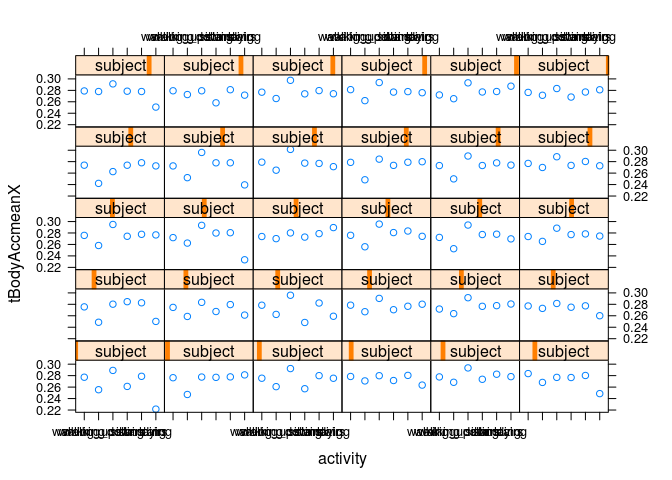
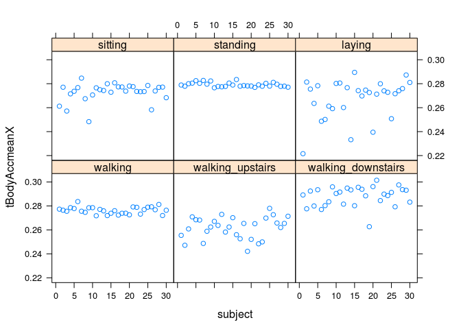

# Getting and cleaning data - Course Project
Remco Niggebrugge  
01/14/2015  
 
 
#Nochtans: activities do not have meaningful names!!!  
 
**This document is for me to keep track**, I do not think a RMarkdown file should be posted as part of this assignment.

These are the steps I am going to take.

**0** Libraries


```r
library(dplyr)
```

```
## 
## Attaching package: 'dplyr'
## 
## The following object is masked from 'package:stats':
## 
##     filter
## 
## The following objects are masked from 'package:base':
## 
##     intersect, setdiff, setequal, union
```

```r
library(lattice)
```

**1** Set working directory to that with all raw data files:


```r
setwd("/home/remco/Desktop/data/small/")
```

**2** Read training files:


```r
subject      <- read.table("./train/subject_train.txt")
activity     <- read.table("./train/y_train.txt")
measurements <- read.table("./train/X_train.txt", sep="")
features     <- read.table("./features.txt")
```

**3** Assign column names:


```r
names(subject)      <- "subject"
names(activity)     <- "activity"
names(measurements) <- features[,2]    ## use 2nd column of features, first column has index
```

**4** Now simply bind the columns (pasting data.frames left-to-right)


```r
train_frame <- cbind(subject, activity, measurements)
```

**5** Now repeat same steps for the test dataset:


```r
subject      <- read.table("./test/subject_test.txt")
activity     <- read.table("./test/y_test.txt")
measurements <- read.table("./test/X_test.txt", sep="")
names(subject)      <- "subject"
names(activity)     <- "activity"
names(measurements) <- features[,2]    ## use 2nd column of features, first column has index

test_frame <- cbind(subject, activity, measurements)
```

**6** Now lets put the two sets together, using *rbind* to paste top-to-bottom:


```r
data <- rbind(train_frame, test_frame)
```

**7** The column names actually contain many characters we do not want there. Let's clean:


```r
names       <- names(data)
names       <- gsub("[)(,\\-]","", names)
names(data) <- names 
```

Also add meaning full labels to activitiy values:


```r
activity_labels    <-read.table("./activity_labels.txt")
activity_labels$V2 <-tolower(activity_labels$V2)
data$activity      <- factor(data$activity, labels=activity_labels[,2])
```

**8** Now find the columns we want to keep:

Let us start by creating a list of all features with name containing *'mean'*, *'Mean'* or *'std'*:


```r
columns <- grep("[[Mm]ean|std]", features[,2]) 
columns <- columns +2       # accounting for the added activity and subject columns
columns <- c(1,2,columns)   # that subsequently need to be added!!
```

Now we are ready to strip our dataset, only keeping those values we are interested in:


```r
data <- data[,columns]
```

Dimensions should be 10299 by 55, check:

```r
dd <- dim(data)
dd
```

```
## [1] 10299    55
```

So: 10299==10299   
And:   55==55  


**9** Group!


```r
new_data_set <- group_by(data, subject, activity) %>% summarise_each(funs(mean))
```

And examine:


```r
with(new_data_set, xyplot(tBodyAccmeanX ~  activity | subject ))
```

 

```r
with(new_data_set, xyplot(tBodyAccmeanX ~  subject | activity ))
```

 

```r
#str(new_data_set)
#summary(new_data_set)
#new_data_set

g <- group_by(new_data_set, subject) %>% summarise_each(funs(mean))
with(g, xyplot(tBodyAccmeanX ~ subject))
```

 
